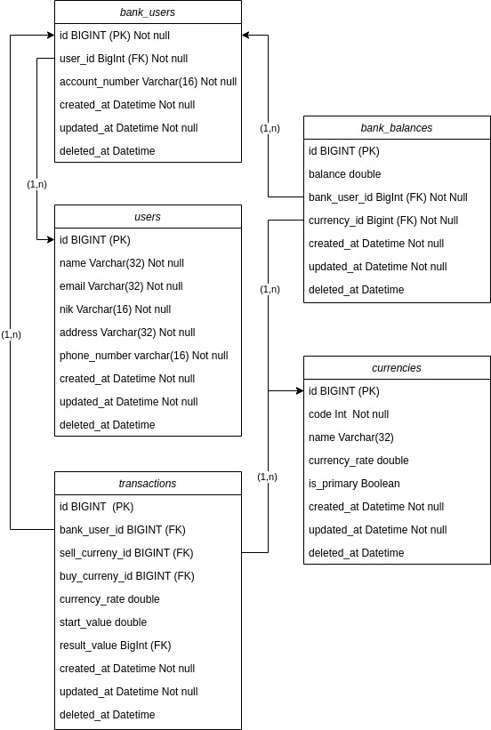

# Java Spring Boot Assignment: Bank MBA
## Members
1. Alif Naufal Hidayat
2. Andika Naufan
3. Muhammad Ridwan Ramadhan
4. Brillian Nane

## How to run
1. Setup your postgres database
2. Execute ddl.sql and dml.sql file which in the location src/sql folder to your database
3. Change the paramater in application.properties file based on your environment
4. Run the application using the command `mvn spring-boot:run`
5. You can test the application at your browser using the url `http://localhost:4000` or you can use this link https://documenter.getpostman.com/view/20730821/2sAYdhLWXS for the documentation endpoint api

## Database Disgn
